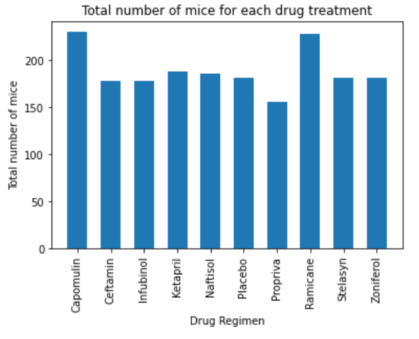
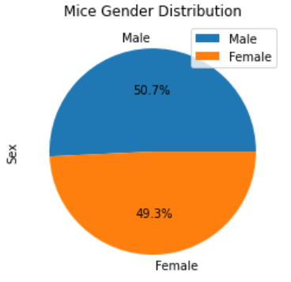

# Matplotlib Project - The Power of Plots

## Background

In this study, 249 mice identified with SCC tumor growth were treated through a variety of drug regimens. Over the course of 45 days, tumor development was observed and measured. The purpose of this study was to compare the performance of Pymaceuticals' drug of interest, Capomulin, versus the other treatment regimens. You have been tasked by the executive team to generate all of the tables and figures needed for the technical report of the study. The executive team also has asked for a top-level summary of the study results.

## Task

In this project, Matplotlib is employed to generate all of the tables and figures needed for the technical report of the animal study and to give a summary of the study results. 

## Results

The results are as follows:

* A summary statistics table is generated consisting of the mean, median, variance, standard deviation, and SEM of the tumor volume for each drug regimen.

* A bar plot is generated using both Pandas's `DataFrame.plot()` and Matplotlib's `pyplot` that shows the number of total mice for each treatment regimen throughout the course of the study.

* A pie plot is generated using both Pandas's `DataFrame.plot()` and Matplotlib's `pyplot` that shows the distribution of female or male mice in the study.

* Using Matplotlib, a box and whisker plot is generated of the final tumor volume for all four treatment regimens and highlight any potential outliers in the plot by changing their color and style.

* A scatter plot is generated of mouse weight versus average tumor volume for the Capomulin treatment regimen.

* The correlation coefficient and linear regression model between mouse weight and average tumor volume for the Capomulin treatment are calculated. 

